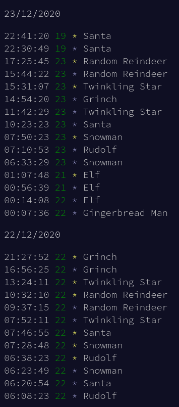

# Advent of Code Leaderboard Log

Userscript that adds a simple event log to private [Advent of Code](https://adventofcode.com/) leaderboards.

## Installation

1. Install a userscript extension such as [Violentmonkey](https://violentmonkey.github.io/) or [Tampermonkey](https://www.tampermonkey.net/) for your browser.
2. Click [here](https://github.com/jhenninger/aoc-leaderboard-log/releases/latest/download/aoc-leaderboard-log.user.js).

## Screenshot

